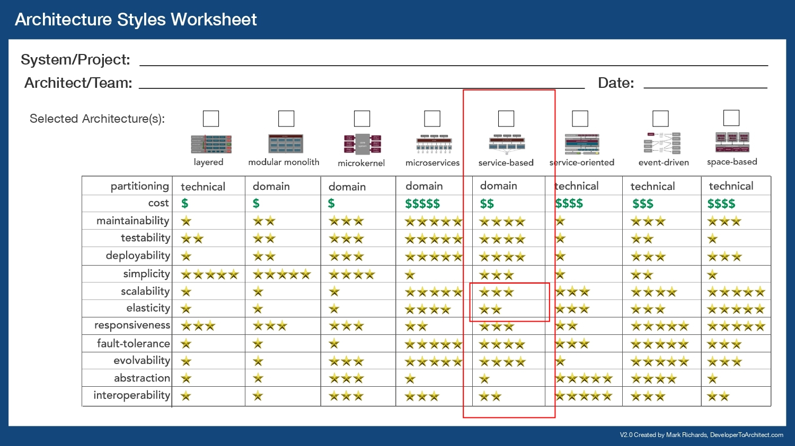

# ADR01 - Choose Architecture Style

Date: 2025-10-20

## Status

Accepted

## Context

Selecting architecture style will have huge impact on how the system will structure, built and performs. From the discovery process, the key architecture characteristic that drive our design are.

- (TOP) Availability
- (TOP) Scalability
- (TOP) Performance
- Cost efficiency
- Security
- Usability

Not all features require the same level of availability, scalability, and performance.

## Decision

We choose **Service Based Architecture**.

It offers flexibility in how the system will structure, built and performs. Service based allow us selectively choose which features that require high level of availability, scalability, and performance while the rest of features can be built using monolith architecture.

We can also reduce the cost of development because monolith architecture naturally simpler to build.

The microservice architecture can also be considered. This architecture can maximize the performance, scalability, and elasticity but not all features requires all of those characteristics.

For this ADR, only the following containers are planned for the architecture. It may change based in the new ADRs.

- Main Web: a web application used by moderators and students for all requirements that have been gathered.
- Main Service: a monolith backend service that will handle all functionality.
- Main Service DB: a relational DB that store data used by the Main Service.

Some requirements like streaming video chat will be handled by dedicated backend service that will be explored in other ADRs.

## Consequences

### Positive

- Allow selective optimization for elasticity, scalability, and performance.
- Reduce development cost & time for less critical components.
- Provide a clear migration path toward microservices if future scalability needs increase.

### Negative

- Require careful boundary definition for each services to avoid tight coupling.
- More complex inter-service communication need to be developed.
