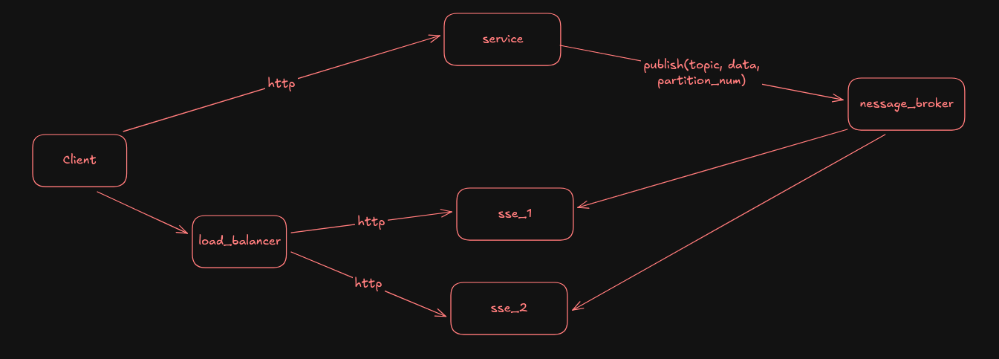

# ADR06 - Scaling Custom Web Service

Date: 2026-01-03

## Status

Accepted

## Context

The custom web service is responsible to handle explore shows & order tickets for users who access the reseller custom web. This service technically only need to call the existing core services' APIs. However, since each reseller can have thousands to millions of users, with high traffic, these services need to be designed to scale properly.

With a requirement where user need to be notified in real time when the ticket they are looking at just got bought, I also need to design how this service handles notification load. Worst case scenario, there will be thousands to millions of users looking at the same ticket.

## Decision

### Scaling the Service

Because this service will only act as a proxy to call the core services' APIs and has minimum logic, it can be scaled horizontally.

In the future, if SLA requirements are strict, drastically different traffic patterns (for explore and order tickets), or other factors arise, I may need to split this service into different services for better scaling.  

### Database

This service will use a dedicated **PostgreSQL** database to handle reseller custom web data such as user account, session, and web configuration. The traffic is expected to be lower than the core services because the majority of the logics will be handled by those services.

### In-Memory Store

Some data access like user session better the read from an in-memory store for lower latency. This service will use **Redis** as the in-memory store to handle such data. 

### Sending the Real Time Notification

To send real time notification to users, I choose to use **SSE** (Server-Sent Events) over WebSocket because the communication is one way only from server to client. Also, it consumes less resources than WebSocket.

With the number of users that will establish SSE connection can be very high, I need to design how to scale the SSE properly.

### Scaling the SSE

To handle high traffic for real time notification, I will use the following strategies:

- There will be `n` of SSE services that responsible to subscribe to notification events and push the updates to connected clients. These services can be scaled horizontally based on the number of connected clients.
- There will be 1 load balancer (a simple service) in front of the SSE service to distribute the incoming connections evenly. The load balancer will only act as a proxy.
- System will store information such as which SSE service a client is connected to in a Redis.
- When the custom web service needs to send notification to a user, it will first check in Redis to find out which SSE services the user is connected to, then send a message the Kafka instance with the notification details and the target SSE service.
- Each SSE service will subscribe to the Kafka topic and filter the messages that are intended for itself. Then it will push the notification to the connected clients.

In the future, the SSE services can be modified to handle other new SSE notifications if needed.

The Kafka topic can be optimized further by using partitioning based on the SSE service ID to reduce the amount of messages each SSE service need to process.

### Syncing Web Configuration

The reseller service will be the source of truth for the custom web configuration data. The reseller service need to communicate with this service through the Kafka topic to sync the web configuration data whenever there is an update.

### Communicate with Core Services

This service will communicate with the core services using **gRPC** for better performance but tooling and debugging will be harder than using HTTP request.

### Result

## Consequences

### Positive

- The custom web service can scale properly to handle high traffic.
- The real time notification can be sent to users efficiently with low latency.
- Simplify development because both explore shows and order tickets functionalities are handled by the same service.
- Using gRPC for communicate with core services will improve performance.

### Negative

- More complex infrastructure to maintain.
- Adding the SSE load balancer and service will increase the development time.
- GRPC has a steeper learning curve, worse tooling, and debugging experience than HTTP request.

## References

- [Scaling WebSockets: The Complete Guide for Engineers](https://sahilserver.substack.com/p/websockets-explained-from-http-upgrade)
